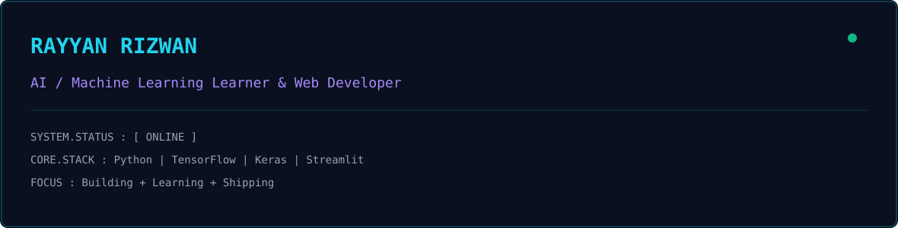

<!-- Phase 1: Animated Banner -->

<picture>

  <source media="(prefers-color-scheme: dark)" srcset="dark.svg">

  <source media="(prefers-color-scheme: light)" srcset="light.svg">

  

</picture>

  

<!-- Phase 2: Streak Card (Cleaned Dates) -->

  

<!-- Phase 3: Profile Summary Dashboard -->

  

<!-- Phase 4: Contribution Snake -->

<picture>

  <source media="(prefers-color-scheme: dark)" srcset="https://raw.githubusercontent.com/Rayyan-Rizwan/Rayyan-Rizwan/output/github-snake-dark.svg" />

  <source media="(prefers-color-scheme: light)" srcset="https://raw.githubusercontent.com/Rayyan-Rizwan/Rayyan-Rizwan/output/github-snake.svg" />

  

</picture>

  

<!-- Phase 5: Social Badges -->

&nbsp;&nbsp;

&nbsp;&nbsp;

